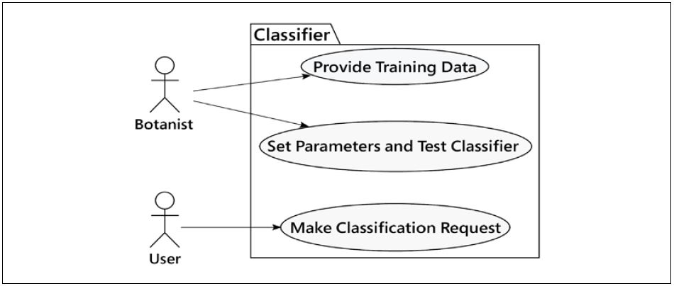
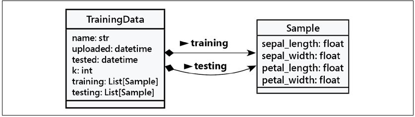
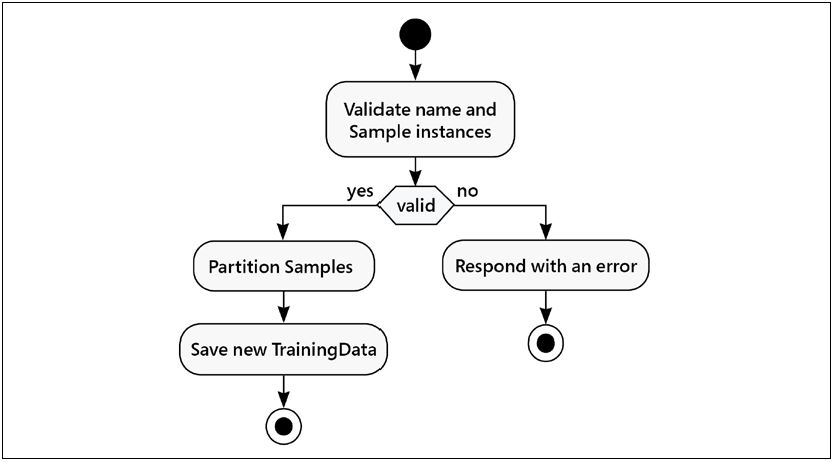
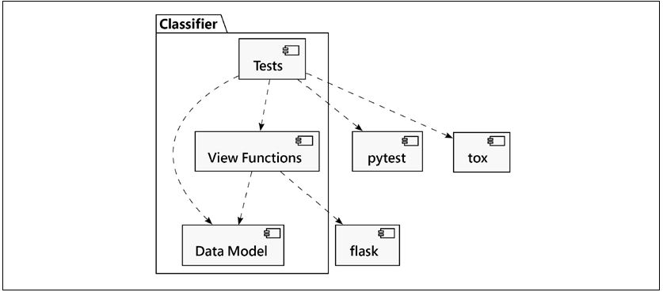
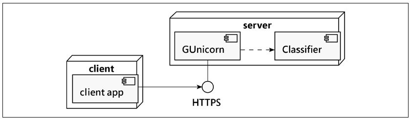

# Iris Classification system design
* We will use [4+1 Views](https://en.wikipedia.org/wiki/4%2B1_architectural_view_model) Model
* Changes to one view will affect all the other views
* The 4 views are described below:
    1. ## Logical View
        * Functionality provided by the system
        * Data entities, attributes and their relationships
    2. ## Process View
        * How system processes communicate and how the data is processed
    3. ## Development View
        * How software components are going to be implemented and class definitions
    4. ## Physical View
        * How different components are integrated and deployed
        * How software is going to be installed on physical hardware
    5. ## Context View
        * External actors or APIs that will interact with the system
* Let's start with context view for a first level understanding
---
## 1. Context View

* Ovals represent user stories
* There are 2 user stories for Botanist and 1 user story for User 
---
## 2. Logical View
* Identify what data needs to be there (always the first step)
* Different classes which link the data and attributes together

---
## 3. Process View
* Deals with the steps in each user story
* We can use flowcharts to describe the processes involved in each user story
* We make [activity diagrams](https://en.wikipedia.org/wiki/Activity_diagram) for steps
* In our case, there are three user stories
    1. Botanist uploads training data
    2. Train classifier with a ***k*** value
    3. Return prediction for a new request
* For scenario #1, we can make the following activity diagram

---
## 4. Development View
* We can indetify 3 modules that need to be implemented for the system to work correctly

* Each component has dependencies on external packages which belong to 3rd parties
* The **Data Model** is developed by us, hence it has no external dependencies
---
## 5. Physical View
* There are mutliple strategies to depoly this application(desktop, mobile or cloud)
* If deployed on a web server, it uses the following architecture

* The Classifier is presented as a black box, while other components are not described in detail